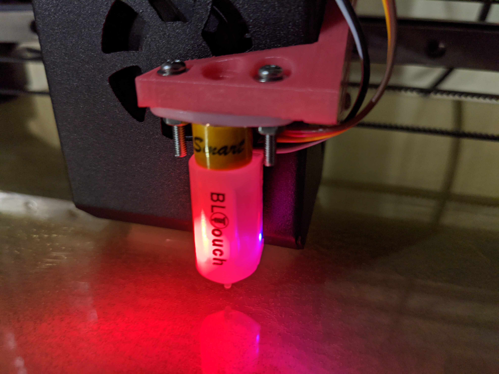
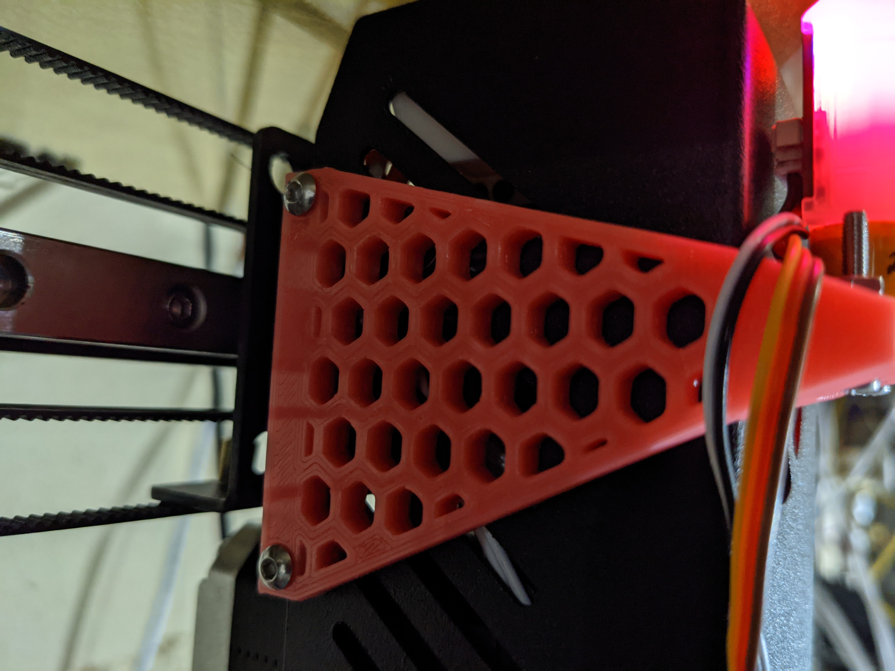
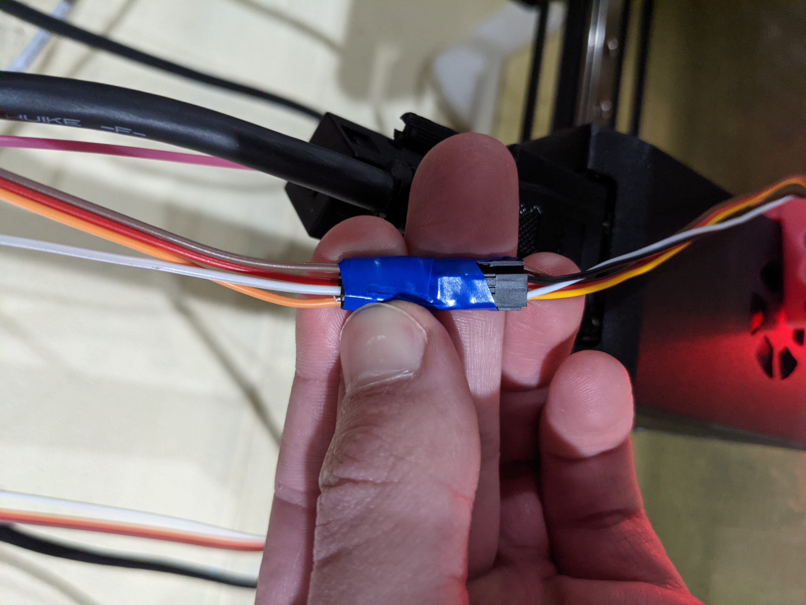
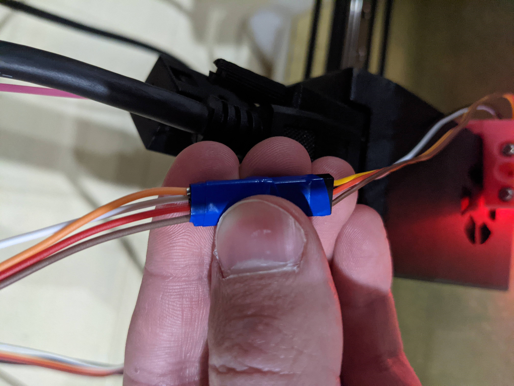
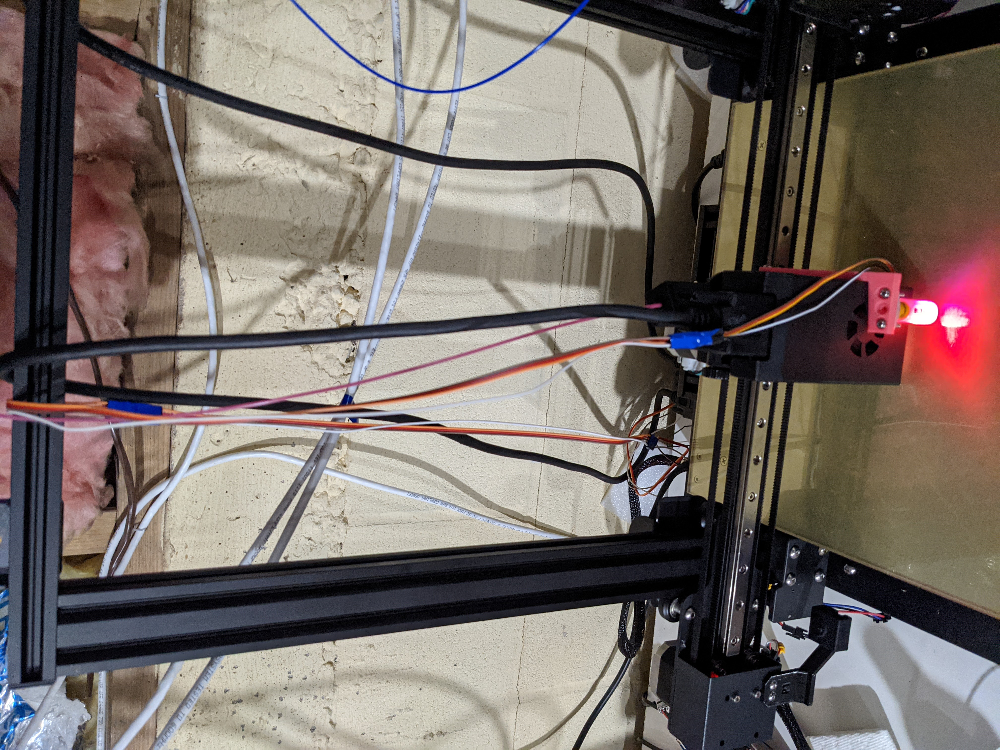
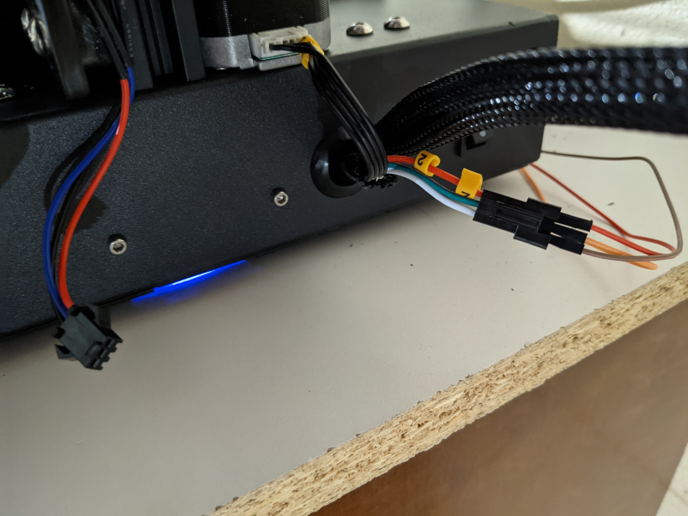
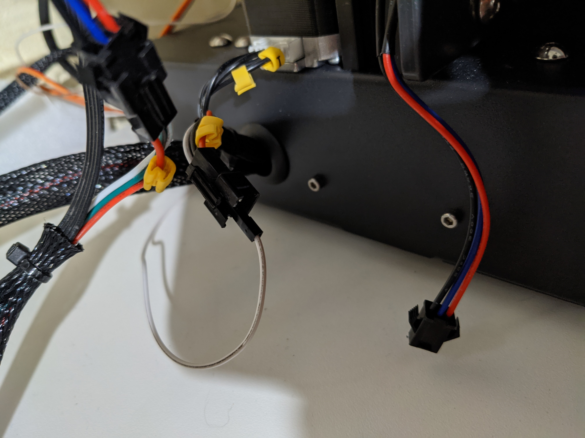

THIS WILL VOID YOUR MANUFACTURER WARRANTY

Do not run this firmware on production machines.

This firmware is a community effort and is not affiliated with Tenlog, Hictop, Copymaster or other distributers.
You assume all risk and liablity by installing this firmware.
It is standard practice for a manufacturer to void your warranty for installing a custom firmware.

## BL-Touch Installation and Configuration
- What does this do?
- What can I expect to be different?
- What do I need to buy?
- How do I install the BL-Touch on the printer?
- How to configure...
  - Install BL-Touch Firmware
  - Probe Offsets
  - Z-Alignment (Since we no longer have 2 endstops)
  - Generate bed mesh
  - Enable UBL auto-leveling
  
### What does this do?
BL-Touch is a probe with amazing accuracy. It can detect the slightest pressure, allowing it to tell the distance it is from a contact surface.

In 3D printing, probes are used to do a few things
- Ensure that your Z home is always a certain distance above the build plate, no matter what plate, without having to adjust endstops or screws.
- Generate a mesh of the bed. Essentially, most beds are not perfectly flate, but instead deviate slightly depending on where you are on the plate. The mesh is like a topography of all of those ups and downs. When printing, you can use this mesh so that your first layer, no matter where the head is, will always be the same distance from the plate in all locations, resulting in an amazing adhesion. With something called Z-fade, it will auto flatten out over a certain size so that part measurements are still accurate.

### What can I expect to be different?
Well, a few things...
- Losing both Z endstops.

  OMG CRASH! Well, not really, let's think about things. So currently, you have an endstop for each Z axis. Now that should make your X axis square with your vertical bars right? Sure it will, but it won't make it square with your build plate now will it? What we do using the BL-Touch is something called a Z-alignment.
  
  Z-alignments are cool. The probe will hit the mid-left and mid-right of the plate, and align the 2 Z axis to be parallel to those two points. That becomes your new Z!
  
- WTH Homing routine?

  So about missing those endstops. Well, to make things safe for everyone, we've taken Z-Safe Homing and upped the ante. (Read up on Z-Safe homing if you don't know what that is)
  
  Instead of a z-home, or a z-safe home, we do the z alignment and take the average and make that the Z-home. When combined with the auto-leveling, this gives us a nice homing start for any print.
  
  While this adds an extra 10 seconds or so onto the homing routine, we feel that it's probably a good idea to provide as safe and seamless an experience for users as possible. Just like a home on the normal build, X1 and 2 will be at home locations, Y will be at home location, and Z will be a bit above it's 0. This is because we will be using bed mesh, and when we start printing, Z will come down to the build plate.

### What do I need to buy?
Well, for starters, a BL-Touch! There are many clones out there, which may or may not work as well. The original, which I (Tom F) would advise getting, is from antclabs. BigTreeTech is an authorized reseller of it. 

Besides the Touch, you also need some jumper extension cables. Speaking of Amazon... 

And that's it!

### How do I install the BL-Touch on the printer?

- Mount the BL-Touch to E1.
  Depending on your extruder type, you need to print out a BL-Touch mount! Use supports for only what's touching the build plate.
  - 
  - 
  - Attach the BL-Touch to the mount.
  
  - Attach the mount to the extruder side.
  
- Run your cables from the BL-Touch along the extruder serial cable to the back of the printer. It is nice to use the same color wires as on the BL-Touch.

- Run the Power(Red), Servo(orange), and Ground(Brown) to the left Z endstop. Run the Sensor(white) to the right Z endstop.

- Unplug your Z endstops. Yep, both of them. You won't need them with the Z-alignment option and we are using the probe as our endstop!
- Plug the wires into each endstop to the correct matchup.
  - Right Endstop
    - Red->Red
    - Green->Orange
    - White->Brown
    
  - Left Endstop
    - Black->White
    
    
That's it! I taped multiple jumper wires together to make the right length cables. All the plugging in is done above the printer!
    
### How to configure...

#### Install BL-Touch Firmware
Well, you need to install the BL-Touch variant of the LuxURI firmware. There's one for each machine and extruder combo. For instructions on this, see Tenlog's documentation on burning firmware.

#### Probe Offsets
This can be a little tricky.
- Home your X and Y axis, and then your Z axis.
- Move your E1 to the middle of the build plate (155, 155).
- Perform an M401 to deploy your probe. Lower the Z until your probe is almost touching the plate.
- Stow your probe with an M402.
- Place a marker where your probe tip is on the plate. Could be painters tape, dry erase marker, whatever. Be pretty precise.
- Now, move your nozzle tip to that exact position and lower your Z until your nozzle is almost touching the plate.
- Validate the nozzle is right at where the probe was.
- Take note of the new X and Y positions.
- The difference between (155, 155) and the new position is your offsets. Negative X is the probe is to the left of the nozzle, positive to the right. Negative Y is the probe is in front of the nozzle, positive behind.
- Slowly lower your Z axis down to zero without letting it hit your bed. You want 0 to be where you would have the nozzle for first layer. A piece of paper sliding with a little resistance. If you are above that at 0, you need to make your Z offset more negative to get where you want. If you can't make 0 without hitting the bed, it needs to be more positive.
- Set probe offsets i.e `M851 X8.5 Y-47.9 Z-2.34`

#### Generate bed mesh
G28 - Home your axis.
G29 P0 - This will clear out any bed mesh stored.
G29 P1 - This will begin the mesh generation! Kind of fun to watch. This only does a certain amount at first, usually the center spiral.
G29 P3 T - This will generate the rest of the mesh. Keep running until it won't do anymore.
G29 S1 - Save the mesh to EEPROM.

#### Enable UBL auto-leveling
G29 A F 10.0 - Enables unified bed leveling with a Z-fade of 10. This means it will gradually even the layers to flat until 10mm high where it will be totally flat.
M500 - Save leveling and settings to EEPROM.
